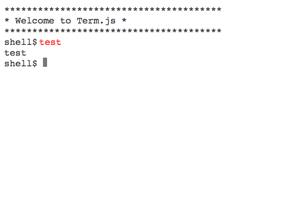

# Term.js

It's a basic terminal implemented in pure Javascript, it provides a basic REPL and you can customize how the commands are interpreted.


## Features
- [X] Basic shell
- [X] Custom command interpreter
- [X] Pure javascript and withour dependencies 
- [X] Command highlighting
- [ ] Command history
- [ ] Quoted arguments support (strings)
- [ ] Suggestion and autocompletion
- [ ] Tab keys and arrow keys movement
- [ ] Output coloring (VT100 emulation or something like that)


## Usage
```html
    <link rel="stylesheet" href="term.css">
    <script src="term.js"></script>
```

## Options
Term.js has only one option, that is the class for read and run the commands:

```javascript
    var term = new Terminal(document.querySelector(".terminal"), {
        interpreterClass: MyCustomClass // The default is the DummyInterpreter
    });
```

## Example

```javascript
    window.addEventListener('load', () => {
        var terminal = new Terminal(document.querySelector(".terminal"));
        terminal.writeLine("***************************************");
        terminal.writeLine("* Welcome to Term.js                 *");
        terminal.writeLine("***************************************");
        terminal.start();
    });
```

I am adding more examples in [termjs/examples](examples) folder.

# Screenshots



## License
[Apache 2.0](LICENSE)
